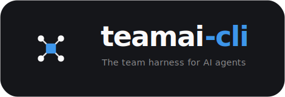

<p align="center">
  
</p>

# TeamAI — The team harness for AI agents

> [English](README.md) | [简体中文](README.zh-CN.md)

[](https://github.com/Tencent/teamai-cli/actions/workflows/ci.yml)
[](https://www.npmjs.com/package/teamai-cli)
[](https://www.npmjs.com/package/teamai-cli)
[](LICENSE)

[](https://discord.gg/gervEZm58g)
[](https://discord.gg/DeHHxPnfZF)

面向 AI 智能体的团队 Harness 分发工具。

通过 Git 统一管理 skills、rules、docs，驾驭 Claude Code / Codex / CodeBuddy / WorkBuddy 等多种 AI 工具。

一个人也能用，团队用更强。

## 快速开始

### 安装

```bash
npm install -g teamai-cli
```

### 团队管理员 / 个人使用者

在 Git 托管平台（GitHub 或 TGit）创建共享经验仓库，**授予团队成员写权限**，然后让他们运行 `teamai init --repo https://github.com/yourorg/yourrepo`。

> 个人使用无需单独建仓：`teamai init` 会检查目标仓库，不存在时自动创建。

### 团队成员

```bash
# 用户级初始化（默认，资源安装到 ~/ 下）
teamai init --repo https://github.com/yourorg/yourrepo

# 项目级初始化（资源安装到项目目录下）
cd /path/to/my-project
teamai init --repo https://github.com/yourorg/yourrepo --scope project
```

初始化完成后，每次开启 AI 会话时都会自动拉取管理员发布的 skills / rules 等 Harness 更新，无需手动同步。

> **完整使用指南**：[docs/usage-guide.zh-CN.md](docs/usage-guide.zh-CN.md)（[English](docs/usage-guide.md)）— 涵盖从团队创建到日常使用的全流程。

## Harness 管理和分发

TeamAI 把 skills、rules、docs、hooks 统一存放在共享 Git 仓库，通过「push → 评审合并 → pull」的流程分发到每位成员的本地 AI 工具，并支持订阅其他团队的 Harness。

### 工作原理

```
teamai push → 创建分支 + MR → reviewer 审批合并
                                    ↓
           SessionStart hook → teamai pull → 同步到本地 AI 工具
```

成员通过 `teamai push` 提交变更并创建合并请求供审核。合并后，`teamai pull`（由 SessionStart hook 在会话启动时自动触发）将最新资源同步到本地。Skills 会同步到 `~/.claude/skills/`、`~/.codex/skills/`、`~/.cursor/skills/`、`~/.codebuddy/skills/` 等目录。

### 团队 Hooks

在 `hooks/hooks.yaml` 中声明自定义 hooks，`teamai pull` 自动分发到所有 AI 工具：

```yaml
hooks:
  - id: block-secret
    description: 提交前扫描密钥
    event: PreToolUse
    matcher: Bash
    command: 'bash -lc "~/.teamai/team-scripts/scan-secret.sh" || true'
    tools: [claude, cursor]
```

```bash
teamai hooks list      # 查看生效的 hooks
teamai hooks inject    # 强制重新注入到所有工具
teamai hooks remove    # 移除所有 teamai 管理的 hooks
```

### 跨团队 Skill 订阅

订阅其他团队的公开 skill 仓库：

```bash
teamai source add https://github.com/other-team/teamai-public.git --name other-team
teamai source list
teamai source browse other-team    # 浏览可用 skills
teamai source remove other-team
```

订阅的 skills 在 `teamai pull` 时自动同步。

## 知识库

除了分发 Harness，TeamAI 还把团队沉淀的经验和代码结构组织成可检索的知识库，让 AI 在需要时自动召回。

### 自动经验沉淀

Session 结束时，Stop hook 按**摩擦信号**对 session 评分——这些信号表明本次 session 踩到了值得记录的东西：你打断或纠正了 AI、拒绝了某次工具调用，或 AI 反复重试出错的工具。又长又顺（工具调用很多但没有摩擦）的 session 不会触发；真正较劲过的 session 才会。达标后 AI 会建议：

```
建议运行 /teamai-share-learnings 总结本次 session 的经验并分享给团队。
```

`/teamai-share-learnings` skill 自动总结 session 经验并推送到团队仓库。每个 session 最多提示一次。

### 团队知识检索

让 AI 在执行任务前自动检索团队积累的知识。该功能**默认关闭**，需显式开启——团队可在 `teamai.yaml` 设 `sharing.recall.enabled: true` 作为默认值，成员也可本地覆盖：

```bash
teamai recall enable     # 开启：部署 teamai-recall 子 agent + 注入引导规则
teamai recall disable    # 关闭：移除子 agent 和规则
teamai recall status     # 查看生效状态（团队默认 + 用户覆盖）
```

**通过子 agent 检索**：开启后 `teamai pull` 会把内置的 `teamai-recall` 子 agent 部署到各 AI 工具的 `agents/` 目录。AI 在任务开始前调用它——由子 agent 提取关键词、执行检索、读取命中的源文件，最后返回结构化的团队知识摘要。子 agent 底层调用的仍是 `teamai recall` 命令，也可手动直接运行：

```bash
$ teamai recall "port conflict"
[1/2] MR review caught a port-conflict bug ★1 [user]
Author: member-a | Score: 18.5 | Tags: troubleshooting, networking

[2/2] Deployment configuration best practices [project]
Author: member-b | Score: 12.0 | Tags: deploy, config
```

**检索内容覆盖两部分**：

- **共享检索索引**（`search-index.json`）：learnings（session 经验）、docs（团队文档）、rules（编码规则）、skills（各 `SKILL.md`）四类，源自团队仓库对应目录，在 `teamai pull` / `teamai contribute` 时构建重建。
- **代码知识图谱**（`teamwiki/`）：由 `teamai import` 生成，检索时实时查询。

排序采用 BM25 + 图谱增强，合并用户 / 项目双 scope 结果并标注来源；搜索会隐式为命中文档投票，优质内容自然上浮。

### 代码知识图谱

`teamai import` 将源码仓库解析为 `teamwiki/` 下的结构化图谱，实现结构感知的检索：

```bash
teamai import --from-repo https://github.com/org/repo
teamai import --from-org myorg              # 批量导入所有仓库
teamai codebase --lint                      # 健康检查
```

图谱存储组件、接口、配置和跨仓库依赖边。`teamai recall` 利用图谱进行增强排名。

## 命令一览

| 命令 | 说明 |
|------|------|
| `teamai init` | 初始化：OAuth 登录、关联仓库、注册成员、注入 hooks |
| `teamai pull` | 拉取团队资源并注入到本地 AI 工具 |
| `teamai push` | 推送本地资源到分支并创建合并请求 |
| `teamai status` | 显示本地与团队仓库的差异 |
| `teamai contribute` | 将 session 经验分享到团队仓库 |
| `teamai recall <query>` | 搜索团队知识库（BM25 + 图谱增强） |
| `teamai recall enable/disable/status` | 开关或查看 recall 状态 |
| `teamai import` | 导入知识（`--dir`、`--from-repo`、`--from-org`、`--from-repo-list`、`--from-mr`、`--from-iwiki`） |
| `teamai codebase --lint` | 知识图谱健康检查 |
| `teamai ci extract-mr --url <url>` | CI：从 MR 提取知识、发评论、合并后写入 |
| `teamai members` | 查看团队成员 |
| `teamai roles` | 管理团队角色和命名空间 |
| `teamai skill exclude add/remove/list` | 管理不参与本地同步的 skills（[使用指南](docs/usage-guide.zh-CN.md#排除个人不需要的-skill)） |
| `teamai source` | 管理跨团队 skill 订阅 |
| `teamai remove <type> <name>` | 删除资源并创建 MR |
| `teamai digest` | 生成团队周报 |
| `teamai doctor` | 诊断配置问题 |
| `teamai uninstall` | 移除所有 teamai 资源和 hooks |

全局选项：`--dry-run`、`--verbose`

## 许可证

[MIT](LICENSE)

## 贡献

欢迎提交 PR！请先阅读 [CONTRIBUTING.md](.github/CONTRIBUTING.md)。
